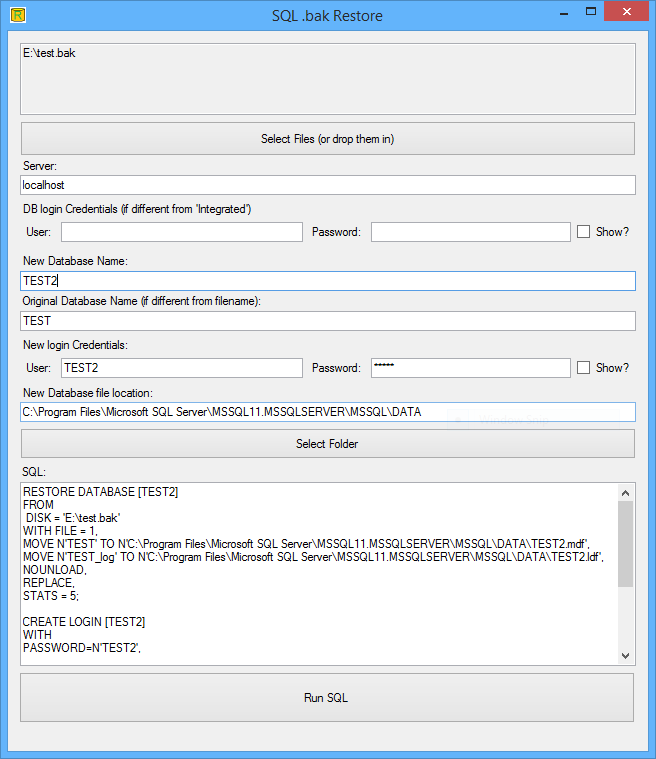
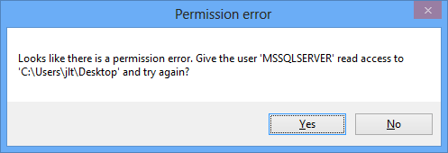
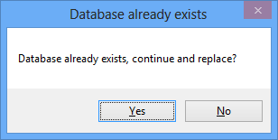
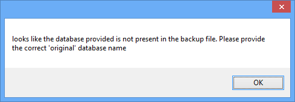

# Restore Database

Small tool meant to make it (a lilte bit) easier to resore a .bak file to a database.

## Features:

The main feature is to restore backups from .bak files. But the tool does a few other tings:

### Manage Permissions

If the Sql server service does not have permission to the file that you are pointing to, the tool can create a `Read` permission:

### Override Existing Database Files

The tool checks if the database file already exists on the system, and promts you to choose if you want to override the existing file:

### Automatic Database Naming

The tool asumes that the name of the selected .bak file, is the same as the database inside the .bak file. If this is not the case the tool promts you to specify the correct name (this is what the `Original Database Name` field is for):

